  <h1 align="center">
    Hi I'm Peter 👋
  </h1>
  

    
  

  

    
  

  I write Python that occasionally works on the first try, build tools that automate the boring stuff, and break things just enough to learn how to fix them.

Currently experimenting with AI-powered sorting, learning C# and discovering features that feel like magic!

I believe in clean code, strong coffee, and the idea that every problem can be solved with just one more print statement. 

Thank you for visiting, and I'd love to [connect](https://www.linkedin.com/in/peter-baggetta-245867203/)!
  
  ---
  

  ### 👨‍💻 About Me:

  💻 I am a Computer Engineering Graduate from the University of Guelph.

  - 💾I have experience as a Full Stack, Python & C Sharp dev as well as knowledge in low-level programming like C (you need to understand how the computer thinks 💭).

  - 📍 How to reach me:  or 
  

  ---

  

  ### 🛠️ Languages and Tools:

  

  

    &nbsp;
    &nbsp;
    &nbsp;
    &nbsp;
    &nbsp;
    &nbsp;
    &nbsp;

  

  ---
  
  ### 📊 My Repos:
  This is not all of my repos and true stats (obviously) I have some private repositories that I am currently working on. Reach out if you're curious!
  

    
  
  

    
<!--      -->
    
  

